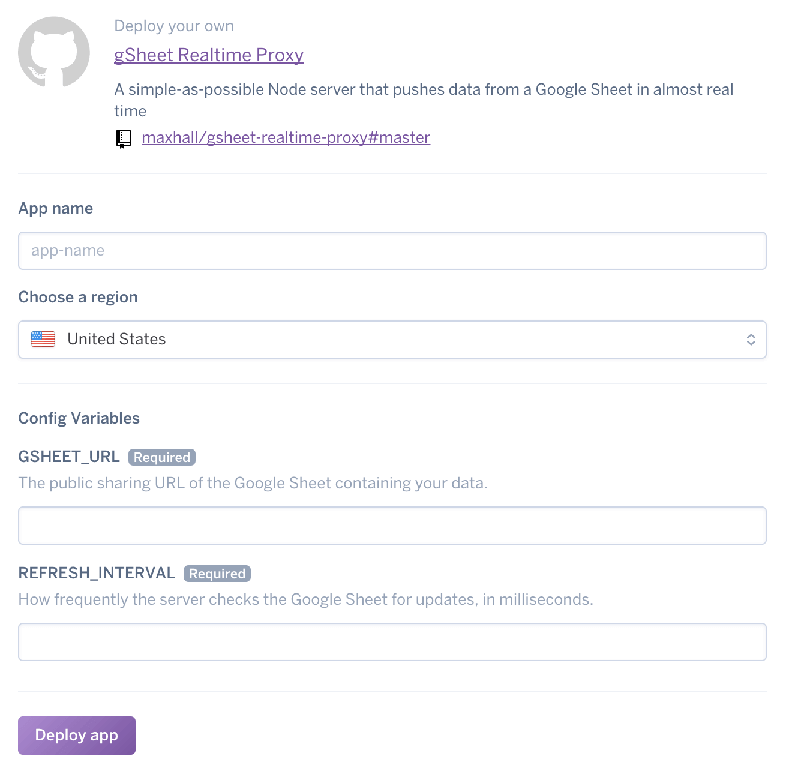

# Tiny gSheet real-time proxy

A simple-as-possible [Node](https://nodejs.org/en/) server that uses [Sheetsy](https://github.com/TehShrike/sheetsy) and [Socket.io](https://socket.io/) to push data from a Google Sheet in very nearly real time.

This project was created for [Honi Soit's 2017 election coverage](http://honisoit.com/2017/09/src-2017-live/).

There are two ways of deploying this project. Which you choose depends on what structure you want your spreadsheet data to have when it reaches your client. By default the server sends a Javascript object containing one object for each sheet of the source Google Sheet. If you're okay with this, follow the simple deployment steps. Otherwise you will want to modify the source before deploying and you should follow the more involved custom deployment.

## Simple deployment: Straight to Heroku

1. I'm assuming you have a spreadsheet of data you want to use. Follow the [Sheetsy's guidelines here](https://github.com/TehShrike/sheetsy#how-to-set-up-your-google-spreadsheet) to set up your spreadsheet and acquire the public sheet URL we will need.

2. Hit this "Deploy to Heroku" button.

[](https://heroku.com/deploy)

3. Sign in to your Heroku account or follow the prompts to make one. You will be taken to a screen that looks like this:



4. Give your app a name and pick a region to host it from the available options. Then all that's left to do is set the app's only two options: the URL of the Google sheet with your source data and how frequently the server should fetch data from it, measured in milliseconds. Be careful not to go too low for the Refresh Interval. Google is known to arbitrarily block people dragging data from their servers too frequently.

5. Press "Deploy app". Watch it build the app. Check the logs in Heroku's management dashboard. If you're URL doesn't seem to be working, follow [these steps](https://github.com/jsoma/tabletop#if-your-publish-to-web-url-doesnt-work).

6. That should be it. Read the client section below for where to head from here.

### Heroku running costs

Heroku gives you 550 free server hours a month for free, and an additional 450 if you register with a credit card. That should be plenty for most projects.

## Custom Deployment: Modified data formatting

1. Install everything locally

I'm assuming you have [Node](https://nodejs.org/en/) and [Heroku's command line tools](https://devcenter.heroku.com/articles/heroku-cli) installed. If you don't, hit those links and follow the instructions.

Make sure you have a Google Sheet set up as described in the simple deployment instructions.

2. Clone this repository to your computer and install all your dependencies.

```sh
$ git clone https://github.com/maxhall/gsheet-socket-server.git your-project-name
$ cd your-project-name
$ npm install
```

3. Set up local variables

The app had no interface. We set two options—the URL of the Google sheet with your source data and how frequently the server should fetch data from it—using environment variables. Create a `.ENV` file in your project folder. Add the following, substituting your Google Sheet URL and preferred refresh interval:

```
GSHEET_URL=https://docs.google.com/THE_REST_OF_YOU_URL
REFRESH_INTERVAL=30000
```

4. Run the server locally

Running `heroku local` in your project directory will start the server locally. Point your browser to `localhost:5000` to find it, though by design it will only respond to websocket requests. Anything else will return a 404 error.

3. Clean up your data

The Javascript object the `getSheetData` function pulls from you Google Sheet will contain a fairly large amount of useless data. You should only send data you actually need to the client, so we pass it through the `cleanSheetData` function. This function takes the full object returned by getSheetData as an argument and returns a clean Javascript object of the data you want to reach the client in whichever structure makes your life easiest.

Edit this function to change the format. The default behaviour returns an object containing one object for each sheet of the source Google Sheet.

4. Deploying to Heroku

If you need to edit the data format, you're probably comfortable with following Heroku's relatively painless git deployment process. The instructions are [here](https://devcenter.heroku.com/articles/git).

## Client

Use the Socket.io client side library to subscribe to the processed data. This can be as simple as linking the Socet.io library in your head tag and inserting the following before the end of your body tag, making sure to replace "your-server-name" in the url with your actual server name:

```
<script src="https://cdnjs.cloudflare.com/ajax/libs/socket.io/2.0.3/socket.io.js"></script>
<script>
  var socket = io('https://your-server-name.herokuapp.com/');
  //var socket = io('localhost:3000');
  socket.on('data', function(msg){
    console.log(msg);
  });
</script>
```

Each time the source spreadsheet updates, your client will receive a fresh Javascript object. What you do with it is up to you. Have fun.
